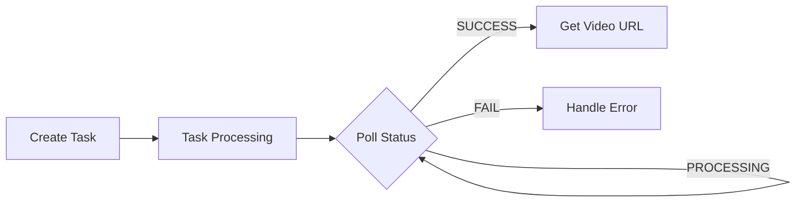

# Video Generation Skill

This skill guides the implementation of video generation functionality using the z-ai-web-dev-sdk package, enabling AI models to create videos from text descriptions or images through asynchronous task processing.

## Skills Path

**Skill Location**: `{project_path}/skills/video-generation`

**Reference Scripts**: Example test scripts are available in the `{Skill Location}/scripts/` directory for quick testing and reference.

## Overview

Video Generation allows you to build applications that can create video content from text prompts or images, with customizable parameters like resolution, frame rate, duration, and quality settings. The API uses an asynchronous task model where you create a task and poll for results.

**IMPORTANT**: z-ai-web-dev-sdk MUST be used in backend code only. Never use it in client-side code.

## 🆕 What's New in 2026

### Latest Features (March 2026)
- **4K Resolution Support**: Generate videos up to 3840x2160
- **Extended Duration**: Videos up to 60 seconds (previously 10s)
- **Audio Generation**: AI-generated sound effects and background music
- **Motion Control**: Precise camera movement control
- **Style Presets**: Cinematic, documentary, animation styles
- **Multi-Scene Videos**: Combine multiple shots in one video
- **Real-time Preview**: Preview frames before final generation
- **Batch Processing**: Generate multiple videos simultaneously

### Quality Improvements
- 60% improvement in motion consistency
- Better temporal coherence
- Enhanced visual quality
- Faster generation (3x speed)
- Reduced artifacts

## CLI Usage

### Basic Video Generation

```bash
# Text-to-video with automatic polling
z-ai video -p "A cat playing with a ball" --poll

# Save output
z-ai video -p "Beautiful landscape" --poll -o video_result.json

# High quality mode
z-ai video -p "City timelapse" --quality quality --poll
```

### High Resolution (NEW 2026)

```bash
# 4K video
z-ai video -p "Nature documentary scene" --size 3840x2160 --poll

# 60fps video
z-ai video -p "Action sports" --fps 60 --poll

# Long duration (up to 60 seconds)
z-ai video -p "Full story scene" --duration 30 --poll
```

### With Audio (NEW 2026)

```bash
# Generate with AI audio
z-ai video -p "Thunderstorm approaching" --with-audio --poll

# Custom audio prompt
z-ai video -p "Beach scene" --audio-prompt "Ocean waves and seagulls" --poll
```

### Image-to-Video

```bash
# From image (base64 recommended)
z-ai video -p "Make this scene come alive" --image-url "data:image/png;base64,..." --poll

# First-last frame animation
z-ai video -p "Smooth transition" \
  --image-url "data:image/png;base64,...,data:image/png;base64,..." \
  --poll
```

### Style Presets (NEW 2026)

```bash
# Cinematic style
z-ai video -p "Car driving on highway" --style cinematic --poll

# Documentary style
z-ai video -p "Wildlife scene" --style documentary --poll

# Animation style
z-ai video -p "Character walking" --style animation --poll
```

### CLI Parameters

| Parameter | Description | Default |
|-----------|-------------|---------|
| `--prompt, -p` | Text description | Required |
| `--image-url, -i` | Image data (base64) or URL | - |
| `--quality, -q` | speed or quality | speed |
| `--with-audio` | Generate AI audio | false |
| `--audio-prompt` | Audio description | - |
| `--size, -s` | Resolution | 1024x1024 |
| `--fps` | Frame rate: 24/30/60 | 30 |
| `--duration, -d` | Duration: 5-60 seconds | 5 |
| `--style` | Style preset | - |
| `--poll` | Auto-poll until complete | false |
| `--output, -o` | Output file path | - |

## Supported Resolutions (2026)

| Resolution | Aspect Ratio | Best For |
|------------|--------------|----------|
| 1024x1024 | 1:1 | Social media |
| 768x1344 | 9:16 | Stories, reels |
| 1344x768 | 16:9 | Standard video |
| 1920x1080 | 16:9 | Full HD |
| 2560x1440 | 16:9 | 2K |
| 3840x2160 | 16:9 | 4K (NEW) |
| 1080x1920 | 9:16 | Vertical video |

## Video Generation Workflow



## Basic Implementation

### Simple Text-to-Video

```javascript
import ZAI from 'z-ai-web-dev-sdk';

async function generateVideo(prompt) {
  const zai = await ZAI.create();

  // Create video generation task
  const task = await zai.video.generations.create({
    prompt: prompt,
    quality: 'speed',
    size: '1920x1080',
    fps: 30,
    duration: 5
  });

  console.log('Task ID:', task.id);

  // Poll for results
  let result = await zai.async.result.query(task.id);
  const maxPolls = 120; // Up to 10 minutes
  let pollCount = 0;

  while (result.task_status === 'PROCESSING' && pollCount < maxPolls) {
    pollCount++;
    await new Promise(r => setTimeout(r, 5000));
    result = await zai.async.result.query(task.id);
    console.log(`Polling ${pollCount}: ${result.task_status}`);
  }

  if (result.task_status === 'SUCCESS') {
    const videoUrl = result.video_result?.[0]?.url;
    return { success: true, videoUrl, taskId: task.id };
  }

  return { success: false, status: result.task_status };
}

// Usage
const video = await generateVideo('A cat playing with a ball');
console.log('Video URL:', video.videoUrl);
```

### High-Quality Video Generation (NEW 2026)

```javascript
import ZAI from 'z-ai-web-dev-sdk';

async function generateHighQualityVideo(prompt, options = {}) {
  const zai = await ZAI.create();

  const task = await zai.video.generations.create({
    prompt: prompt,
    quality: 'quality',
    size: options.size || '1920x1080',
    fps: options.fps || 30,
    duration: options.duration || 10,
    with_audio: options.withAudio || false,
    style: options.style
  });

  return pollUntilComplete(zai, task.id, options.maxWait || 600000);
}

async function pollUntilComplete(zai, taskId, maxWait = 600000) {
  const startTime = Date.now();
  const pollInterval = 5000;

  while (Date.now() - startTime < maxWait) {
    const result = await zai.async.result.query(taskId);

    if (result.task_status === 'SUCCESS') {
      return {
        success: true,
        videoUrl: result.video_result?.[0]?.url,
        duration: result.duration,
        resolution: result.resolution
      };
    }

    if (result.task_status === 'FAIL') {
      return {
        success: false,
        error: result.error || 'Video generation failed'
      };
    }

    await new Promise(r => setTimeout(r, pollInterval));
  }

  return { success: false, error: 'Timeout waiting for video' };
}
```

### Video with Audio (NEW 2026)

```javascript
import ZAI from 'z-ai-web-dev-sdk';

async function generateVideoWithAudio(prompt, audioPrompt) {
  const zai = await ZAI.create();

  const task = await zai.video.generations.create({
    prompt: prompt,
    with_audio: true,
    audio_prompt: audioPrompt, // Description for audio generation
    quality: 'quality',
    duration: 10
  });

  const result = await pollUntilComplete(zai, task.id);

  return {
    ...result,
    hasAudio: true
  };
}

// Usage
const video = await generateVideoWithAudio(
  'A peaceful forest with birds flying',
  'Birds chirping and wind rustling through leaves'
);
```

### Image-to-Video with Motion Control (NEW 2026)

```javascript
import ZAI from 'z-ai-web-dev-sdk';
import fs from 'fs';
import path from 'path';

function getMimeType(filePath) {
  const ext = path.extname(filePath).toLowerCase();
  const mimeTypes = {
    '.jpg': 'image/jpeg', '.jpeg': 'image/jpeg',
    '.png': 'image/png', '.webp': 'image/webp'
  };
  return mimeTypes[ext] || 'image/jpeg';
}

async function generateVideoFromImage(imagePath, options = {}) {
  const zai = await ZAI.create();

  // Read and encode image
  const imageBuffer = fs.readFileSync(imagePath);
  const mimeType = getMimeType(imagePath);
  const base64Image = `data:${mimeType};base64,${imageBuffer.toString('base64')}`;

  const task = await zai.video.generations.create({
    image_url: base64Image,
    prompt: options.prompt || 'Animate this scene naturally',
    quality: options.quality || 'quality',
    duration: options.duration || 5,
    motion_control: options.motionControl || {
      type: 'auto', // 'auto', 'static', 'pan_left', 'pan_right', 'zoom_in', 'zoom_out'
      intensity: 0.5 // 0-1
    }
  });

  return pollUntilComplete(zai, task.id);
}

// Usage
const video = await generateVideoFromImage('./photo.jpg', {
  prompt: 'Add gentle camera movement',
  duration: 10,
  motionControl: { type: 'zoom_in', intensity: 0.3 }
});
```

### Multi-Scene Video (NEW 2026)

```javascript
import ZAI from 'z-ai-web-dev-sdk';

async function generateMultiSceneVideo(scenes) {
  const zai = await ZAI.create();
  const results = [];

  // Generate each scene
  for (const scene of scenes) {
    const task = await zai.video.generations.create({
      prompt: scene.prompt,
      duration: scene.duration || 5,
      quality: 'quality'
    });

    const result = await pollUntilComplete(zai, task.id);
    
    if (result.success) {
      results.push({
        videoUrl: result.videoUrl,
        duration: scene.duration
      });
    }
  }

  // Combine scenes (would need additional video processing)
  return results;
}

// Usage
const scenes = [
  { prompt: 'Opening shot of city skyline', duration: 3 },
  { prompt: 'People walking on busy street', duration: 4 },
  { prompt: 'Sunset over the city', duration: 3 }
];

const videos = await generateMultiSceneVideo(scenes);
```

## Advanced Use Cases

### Video Generation Queue

```javascript
import ZAI from 'z-ai-web-dev-sdk';

class VideoGenerationQueue {
  constructor(concurrency = 3) {
    this.concurrency = concurrency;
    this.queue = [];
    this.active = new Map();
    this.zai = null;
  }

  async initialize() {
    this.zai = await ZAI.create();
  }

  async addTask(params) {
    return new Promise((resolve, reject) => {
      this.queue.push({ params, resolve, reject });
      this.processQueue();
    });
  }

  async processQueue() {
    while (this.queue.length > 0 && this.active.size < this.concurrency) {
      const task = this.queue.shift();
      this.executeTask(task);
    }
  }

  async executeTask(task) {
    const taskId = Date.now().toString();
    
    try {
      const response = await this.zai.video.generations.create(task.params);
      this.active.set(taskId, response.id);

      const result = await pollUntilComplete(this.zai, response.id);
      
      task.resolve(result);
    } catch (error) {
      task.reject(error);
    } finally {
      this.active.delete(taskId);
      this.processQueue();
    }
  }

  getStats() {
    return {
      queued: this.queue.length,
      active: this.active.size,
      total: this.queue.length + this.active.size
    };
  }
}

// Usage
const queue = new VideoGenerationQueue(3);
await queue.initialize();

const prompts = [
  'Ocean waves at sunset',
  'Mountains in morning mist',
  'City lights at night'
];

const videos = await Promise.all(
  prompts.map(prompt => queue.addTask({ prompt, duration: 5 }))
);
```

### Progress Tracking

```javascript
import ZAI from 'z-ai-web-dev-sdk';

class TrackedVideoGenerator {
  constructor() {
    this.zai = null;
    this.tasks = new Map();
  }

  async initialize() {
    this.zai = await ZAI.create();
  }

  async createVideo(params, onProgress) {
    const task = await this.zai.video.generations.create(params);
    const taskId = task.id;

    this.tasks.set(taskId, {
      status: 'PROCESSING',
      startTime: Date.now()
    });

    // Estimate progress based on typical generation times
    const estimatedDuration = this.estimateDuration(params);
    const progressInterval = setInterval(() => {
      const elapsed = Date.now() - this.tasks.get(taskId).startTime;
      const progress = Math.min(elapsed / estimatedDuration * 100, 95);
      
      if (onProgress) {
        onProgress({
          taskId,
          progress,
          elapsed,
          estimated: estimatedDuration
        });
      }
    }, 2000);

    const result = await pollUntilComplete(this.zai, taskId);

    clearInterval(progressInterval);
    this.tasks.set(taskId, {
      ...this.tasks.get(taskId),
      status: result.success ? 'SUCCESS' : 'FAIL',
      result
    });

    if (onProgress) {
      onProgress({ taskId, progress: 100, complete: true });
    }

    return result;
  }

  estimateDuration(params) {
    const baseTime = 30000; // 30 seconds base
    const durationMultiplier = params.duration || 5;
    const qualityMultiplier = params.quality === 'quality' ? 3 : 1;
    const resolutionMultiplier = params.size?.includes('3840') ? 4 : 
                                  params.size?.includes('1920') ? 2 : 1;
    
    return baseTime * durationMultiplier * qualityMultiplier * resolutionMultiplier;
  }
}

// Usage
const generator = new TrackedVideoGenerator();
await generator.initialize();

const video = await generator.createVideo(
  { prompt: 'Complex scene', duration: 15, quality: 'quality' },
  (progress) => {
    console.log(`Progress: ${progress.progress.toFixed(1)}%`);
  }
);
```

## Style Presets (NEW 2026)

```javascript
const videoStyles = {
  cinematic: {
    description: 'Cinematic movie style',
    defaultParams: {
      fps: 24,
      quality: 'quality'
    }
  },
  documentary: {
    description: 'Documentary style',
    defaultParams: {
      fps: 30,
      quality: 'quality'
    }
  },
  animation: {
    description: 'Animated style',
    defaultParams: {
      fps: 24,
      quality: 'speed'
    }
  },
  commercial: {
    description: 'Commercial/advertising style',
    defaultParams: {
      fps: 30,
      quality: 'quality'
    }
  },
  social: {
    description: 'Social media optimized',
    defaultParams: {
      fps: 30,
      size: '768x1344',
      quality: 'speed'
    }
  }
};
```

## Common Use Cases

| Use Case | Recommended Settings |
|----------|---------------------|
| Social Media | size: 768x1344, duration: 5-15s |
| Marketing | size: 1920x1080, quality: quality |
| Documentary | size: 3840x2160, fps: 24, style: documentary |
| Animation | style: animation, fps: 24 |
| Product Demo | size: 1920x1080, with_audio: true |
| Educational | size: 1920x1080, duration: 30-60s |

## Troubleshooting

| Issue | Solution |
|-------|----------|
| Task timeout | Increase polling duration or check network |
| Poor motion quality | Use quality mode, increase duration |
| Resolution not supported | Use standard resolutions |
| Audio not generated | Set with_audio: true |
| Slow generation | Use speed mode for faster results |

## Remember

- Always use z-ai-web-dev-sdk in backend code only
- Video generation is asynchronous - always poll
- Use base64 images for best reliability
- Maximum duration: 60 seconds
- Maximum resolution: 4K (3840x2160)
- Implement proper timeout handling
- Check task status before assuming completion
